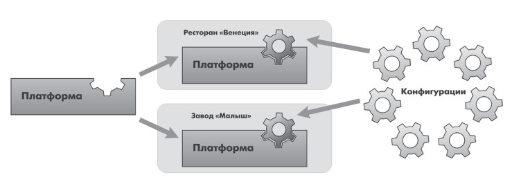

# 1С:Предприятие 8.3. Практическое пособие разработчика. Примеры и типовые приемы.
## ЗАНЯТИЕ 1 (0:40)
### Что такое конфигурируемость системы «1С:Предприятие»?

«1С:Предприятие» является универсальной системой автоматизации экономической и организационной деятельности предприятия. Поскольку такая деятельность может быть довольно разнообразной, система «1С:Предприятие» может приспосабливаться к особенностям конкретной области деятельности, в которой она применяется. Для обозначения такой способности используется термин <i><b>конфигурируемость</b></i>, то есть возможность настройки системы на особенности конкретного предприятия и класса решаемых задач.

### Из каких основных частей состоит система?

Логически всю систему можно разделить на две большие части, которые тесно взаимодействуют друг с другом – <i><b>конфигурацию и платформу</b></i>, которая управляет работой конфигурации.  

### Что такое платформа и что такое конфигурация?

<i><b>Платформа</b></i> обеспечивает работу конфигурации и позволяет вносить в нее изменения или создавать собственную конфигурацию. <i><b>Конфигурация</b></i> это та часть системы «1С:Предприятие», которая работает под управлением платформы и которую видят все пользователи. Существует одна платформа («1С:Предприятие») и множество конфигураций. Для функционирования какого-либо прикладного решения всегда необходима платформа и какая-либо (одна) конфигурация.

<figure class = "pic1_1">
	
	<figcaption><b>Рис 1.1</b> Конфигураций много а платформа одна</figcaption>
</figure>

### Для чего используются разные режимы запуска системы «1С:Предприятие»?

<i><b>Режим 1С:Предприятие</b></i> является основным и служит для работы пользователей системы. В этом режиме пользователи вносят данные, обрабатывают их и получают итоговые результаты. <i><b>Режим Конфигуратор</b></i> используется разработчиками и администраторами информационных баз. Именно этот режим и предоставляет инструменты, необходимые для модификации существующей или создания новой конфигурации.

### Что такое дерево объектов конфигурации?

<i><b>Дерево объектов конфигурации</b></i> – основной инструмент, с которым работает разработчик. Дерево объектов конфигурации содержит в себе практически всю информацию о том, из чего состоит конфигурация.

### Что такое объекты конфигурации?

Для того чтобы систему «1С:Предприятие» можно было быстро 
и легко настраивать на нужные прикладные задачи, все описание, 
которое содержит конфигурация, состоит из неких логических 
единиц, называемых <i><b>объектами конфигурации.</b></i> Мы можем создавать только 
объекты определенных видов. Но каждого вида объектов мы можем создать столько, сколько нам нужно. Объекты одного вида отличаются от объектов другого вида тем, что имеют разные свойства. Объекты могут взаимодействовать друг с другом, и мы можем описать такое взаимодействие. Объекты конфигурации также обладают различным поведением, и оно зависит от вида объекта. Объекты конфигурации не просто некие абстрактные конструкции, при помощи которых разработчик 
пытается описать поставленную перед ним задачу. Они представляют 
собой аналоги реальных объектов, которыми оперирует предприятие 
в ходе своей работы. 

###  Что создает система на основе объектов конфигурации?

На основе объектов конфигурации платформа <i><b>создает в базе данных таблицы, в которых будут храниться данные.</b></i> В литературе, как правило, объект конфигурации и соответствующий 
ему набор таблиц базы данных принято называть одинаково.

### Какими способами можно добавить новый объект конфигурации?

<i>Первый способ.</i> Необходимо установить курсор на ту ветку объектов 
конфигурации, которая вас интересует, и в командной панели окна 
конфигурации нажать кнопку <b>Действия > Добавить</b> 
<i>Второй способ.</i> Вы можете воспользоваться контекстным меню, 
которое вызывается при нажатии на правую клавишу мыши. Установите курсор на интересующую вас ветку объектов конфигурации и нажмите правую клавишу мыши. В появившемся меню выберите 
пункт <b>Добавить</b> 
<i>Третий способ.</i> Установите курсор на интересующую вас ветку объектов конфигурации и в командной панели окна конфигурации нажмите кнопку <b>Добавить</b> (с пиктограммой +)

### Зачем нужна палитра свойств?

<i><b>Палитра свойств</b></i>     – это специальное служебное окно, которое 
позволяет редактировать все свойства объекта конфигурации 
и другую связанную с ним информацию.

### Как запустить «1С:Предприятие» в режиме отладки?

Для этого выполним пункт меню <b>Отладка > Начать отладку</b> или 
нажмем соответствующую кнопку на панели инструментов 
конфигуратора. Система сама анализирует наличие изменений 
в конфигурации и выдает соответствующий вопрос об обновлении 
конфигурации базы данных.

